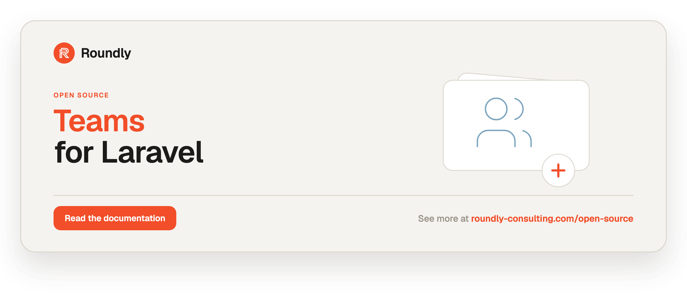

<!-- roundly-hero:start -->
<p align="center">
  <a href="https://roundly-consulting.com/open-source/docs/teams-for-laravel?utm_source=github&utm_medium=readme&utm_campaign=open-source&utm_content=teams-for-laravel">
    
  </a>
</p>
<!-- roundly-hero:end -->

<!-- roundly-badges:start -->
<p align="center">
  <a href="https://packagist.org/packages/roundly-consulting/teams-for-laravel"></a>
  <a href="https://github.com/roundly-consulting/teams-for-laravel/actions/workflows/run-tests.yml"></a>
  <a href="https://github.com/roundly-consulting/teams-for-laravel/actions/workflows/fix-php-code-style-issues.yml"></a>
  <a href="https://donate.stripe.com/dRmeVe8FX5PF1Qd9pXcEw00"></a>
  <a href="https://www.patreon.com/cw/roundly"></a>
  <a href="https://roundly-consulting.com/support-us?utm_source=github&utm_medium=readme&utm_campaign=open-source&utm_content=teams-for-laravel#crypto"></a>
</p>
<!-- roundly-badges:end -->

# Teams for Laravel

Associate users with teams, roles, permissions, and invitations in Laravel.

This package gives any Eloquent model the ability to own and join teams. Members carry a
role, roles carry permissions, and teams can issue expiring, email-targeted invites. A
discoverable `Teams` facade with team-scoped handles expresses the common operations in a
single line, business logic lives in testable action classes, and roles can be defined in code or
stored in the database. Teams, members, and invites are soft-deletable, and expired invites
are automatically prunable.

Beyond the basics it supports **per-team role overrides** (tenant-scoped permission sets), a
**permission registry** for building picker UIs, **resend / multi-use invites**, a
first-class **owner** gate ability, **join requests** (the inverse of invites),
**time-boxed memberships**, a **cache-backed** role provider, publishable
controller/policy/notification **stubs**, and **test helpers** (`Teams::fake()` plus Pest
expectation matchers).

## Requirements

- PHP 8.4+
- Laravel 12 or 13

## Installation

Install the package via Composer:

```bash
composer require roundly-consulting/teams-for-laravel
```

Publish and run the migrations — this package's **and those of the roundly packages it builds
on**. Publishing is **required**: none of them auto-load their migrations, so a bare
`php artisan migrate` creates no tables. Teams reads its per-team settings (join policy, seat
cap, default role) from the options package on every member add and join request, so the
`options` table is needed from the very first `Teams::create()`; the contacts, addresses,
connections and approvals tables back `Teams::for($team)->contacts()`, `->addresses()`,
`->connections()` and the governed join-request sign-off:

```bash
php artisan vendor:publish --tag="options-migrations"
php artisan vendor:publish --tag="contacts-migrations"
php artisan vendor:publish --tag="addresses-migrations"
php artisan vendor:publish --tag="connections-migrations"
php artisan vendor:publish --tag="approvals-migrations"
php artisan vendor:publish --tag="teams-migrations"
php artisan migrate
```

The six teams migrations publish timestamp-injected and in dependency order (`teams` first,
then the tables whose foreign keys reference it), so they order correctly against your
own migrations. Republishing lands on the same files, so `--force` overwrites in place.
Migrations only migrate forward: rolling them back leaves the tables in place.

Optionally publish the config file or translations:

```bash
php artisan vendor:publish --tag="teams-config"
php artisan vendor:publish --tag="teams-translations"
```

Optionally publish the ready-to-wire stubs (accept-invite controller + routes, a queued
event subscriber, and a Pest expectations file):

```bash
php artisan vendor:publish --tag="teams-stubs"
```

## Configuration

The published `config/teams.php`:

```php
<?php

use RoundlyConsulting\Teams\Models\Invite;
use RoundlyConsulting\Teams\Models\JoinRequest;
use RoundlyConsulting\Teams\Models\Member;
use RoundlyConsulting\Teams\Models\Team;
use RoundlyConsulting\Teams\Models\TeamRole;

return [

    'models' => [
        'team' => Team::class,
        'member' => Member::class,
        'invite' => Invite::class,
        'team_role' => TeamRole::class,
        'join_request' => JoinRequest::class,
    ],

    'key_type' => env('TEAMS_KEY_TYPE', 'bigint'),

    'roles' => [
        'provider' => env('TEAMS_ROLES_PROVIDER', 'array'),
        'owner' => 'owner',
        'admin' => 'admin',
        'default' => env('TEAMS_DEFAULT_ROLE', 'member'),
        'per_team' => env('TEAMS_PER_TEAM_ROLES', false),
        'cache' => [
            'enabled' => env('TEAMS_ROLES_CACHE', false),
            'store' => env('TEAMS_ROLES_CACHE_STORE'),
            'key' => env('TEAMS_ROLES_CACHE_KEY', 'teams.roles'),
            'ttl' => (int) env('TEAMS_ROLES_CACHE_TTL', 3600),
        ],
    ],

    'invites' => [
        'expires_after' => env('TEAMS_INVITES_EXPIRES_AFTER', '7 days'),
        'code_length' => (int) env('TEAMS_INVITES_CODE_LENGTH', 32),
    ],

    'members' => [
        'prune_after' => env('TEAMS_MEMBERS_PRUNE_AFTER', '30 days'),
        'expiring_within' => (int) env('TEAMS_MEMBERS_EXPIRING_WITHIN', 7),
    ],

    'join_requests' => [
        'prune_after' => env('TEAMS_JOIN_REQUESTS_PRUNE_AFTER', '30 days'),
    ],

    'approvals' => [
        'enabled' => env('TEAMS_APPROVALS', false),
        'rule' => env('TEAMS_APPROVALS_RULE', 'unanimous'),
        'quorum' => env('TEAMS_APPROVALS_QUORUM') !== null ? (int) env('TEAMS_APPROVALS_QUORUM') : null,
    ],

    'gate' => [
        'register' => env('TEAMS_REGISTER_GATE', true),
        'prefix' => env('TEAMS_GATE_PREFIX', 'teams'),
        'owner_ability' => env('TEAMS_GATE_OWNER_ABILITY', 'owner'),
    ],

    'notifications' => [
        'queue_connection' => env('TEAMS_NOTIFY_CONNECTION'),
    ],

];
```

| Key                              | Type           | Default              | Env                            | Purpose                                                                          |
|----------------------------------|----------------|----------------------|--------------------------------|----------------------------------------------------------------------------------|
| `models.team`                    | `class-string` | `Team::class`        | —                              | Model used for teams and relationship resolution.                                |
| `models.member`                  | `class-string` | `Member::class`      | —                              | Model used for team members.                                                     |
| `models.invite`                  | `class-string` | `Invite::class`      | —                              | Model used for team invites.                                                      |
| `models.team_role`               | `class-string` | `TeamRole::class`    | —                              | Model used for per-team role overrides.                                          |
| `models.join_request`            | `class-string` | `JoinRequest::class` | —                              | Model used for join requests.                                                    |
| `key_type`                       | `string`       | `bigint`             | `TEAMS_KEY_TYPE`               | Key type of the polymorphic `owner` / `member` / `invited_by` / `requester` / `responded_by` columns: `bigint`, `uuid` or `ulid` (anything else throws `InvalidConfigurationException`). Read when the migrations run — set it before migrating. |
| `roles.provider`                 | `string`       | `array`              | `TEAMS_ROLES_PROVIDER`         | Role storage driver: `array` (in code) or `database` (persisted).                |
| `roles.owner`                    | `string`       | `owner`              | —                              | Role key granted to a team's creator/owner.                                      |
| `roles.admin`                    | `string`       | `admin`              | —                              | Role a previous owner is demoted to when ownership is transferred.               |
| `roles.default`                  | `string`       | `member`             | `TEAMS_DEFAULT_ROLE`           | Role applied when none is supplied (e.g. approving a join request).              |
| `roles.per_team`                 | `bool`         | `false`              | `TEAMS_PER_TEAM_ROLES`         | Enable per-team role overrides. Off = global roles only, zero extra queries.     |
| `roles.cache.enabled`            | `bool`         | `false`              | `TEAMS_ROLES_CACHE`            | Cache the `database` role map, flushing on every role mutation.                  |
| `roles.cache.store`              | `?string`      | `null`               | `TEAMS_ROLES_CACHE_STORE`      | Cache store to use; `null` uses the default store. Tags used when supported.     |
| `roles.cache.key`                | `string`       | `teams.roles`        | `TEAMS_ROLES_CACHE_KEY`        | Cache key for the role map.                                                      |
| `roles.cache.ttl`                | `int`          | `3600`               | `TEAMS_ROLES_CACHE_TTL`        | Cache lifetime in seconds.                                                       |
| `invites.expires_after`          | `string`       | `7 days`             | `TEAMS_INVITES_EXPIRES_AFTER`  | Relative interval used as the default invite expiry when none is supplied.       |
| `invites.code_length`            | `int`          | `32`                 | `TEAMS_INVITES_CODE_LENGTH`    | Length of the generated random invite code.                                      |
| `members.prune_after`            | `string`       | `30 days`            | `TEAMS_MEMBERS_PRUNE_AFTER`    | Interval after a membership's expiry before `teams:members:prune` / `model:prune` deletes it. |
| `members.expiring_within`        | `int`          | `7`                  | `TEAMS_MEMBERS_EXPIRING_WITHIN` | Default window (days) for `teams:members:expiring` and `MembershipExpiringSoon`. |
| `join_requests.prune_after`      | `string`       | `30 days`            | `TEAMS_JOIN_REQUESTS_PRUNE_AFTER` | Interval after a resolved request's update before `model:prune` deletes it.    |
| `approvals.enabled`              | `bool`         | `false`              | `TEAMS_APPROVALS`              | Route join requests staged with `requireApprovalFrom()` through the approvals engine (see [Governed join-request sign-off](#governed-join-request-sign-off-approvals)). |
| `approvals.rule`                 | `string`       | `unanimous`          | `TEAMS_APPROVALS_RULE`         | Default `ApprovalRule` value when the handle sets none: `unanimous`, `quorum`, `any` or `weighted` (anything else throws `InvalidConfigurationException`). |
| `approvals.quorum`               | `?int`         | `null`               | `TEAMS_APPROVALS_QUORUM`       | Default quorum when the handle sets none.                                         |
| `gate.register`                  | `bool`         | `true`               | `TEAMS_REGISTER_GATE`          | Register Laravel Gate abilities and Blade directives for team permissions.       |
| `gate.prefix`                    | `string`       | `teams`              | `TEAMS_GATE_PREFIX`            | Ability-name prefix, e.g. `teams.manage-billing`.                                |
| `gate.owner_ability`             | `string`       | `owner`              | `TEAMS_GATE_OWNER_ABILITY`     | Short ability that resolves to team ownership: `teams.owner`.                     |
| `notifications.queue_connection` | `?string`      | `null`               | `TEAMS_NOTIFY_CONNECTION`      | Queue connection consumed by the publishable event-subscriber stub.              |

The `bool` keys take env strings as they come: `true`/`1`/`on`/`yes` switch a flag on and
`false`/`0`/`off`/`no` (or an empty value) switch it off. Anything else — a typo such as
`TEAMS_APPROVALS=disabled` — throws `InvalidConfigurationException` instead of quietly
reading as the default.

Once the migrations above are published and run, the package works with zero configuration.

## Usage

### The `Teams` facade

`Teams` is the entry point for everything the package does. Team-scoped work hangs off
`Teams::for($team)`, which returns a handle with one sub-accessor per area; cross-team work
(accepting an invite by code, housekeeping, the role and permission vocabulary) sits on the
facade itself.

```php
use RoundlyConsulting\Teams\DataTransferObjects\CreateTeamData;
use RoundlyConsulting\Teams\Facades\Teams;

// Create a team; the owner joins with the configured owner role.
$team = Teams::create(new CreateTeamData(name: 'Acme', owner: $owner));

// Members
Teams::for($team)->members()->add($alice, 'admin', expiresAt: now()->addYear());
Teams::for($team)->members()->changeRole($alice, 'editor');   // throws MemberNotFoundException for a non-member
Teams::for($team)->members()->remove($bob);                   // bool
Teams::for($team)->members()->all();                          // Collection<Member>
Teams::for($team)->members()->has($alice);                    // bool
Teams::for($team)->members()->find($alice);                   // ?Member

// Invites
$invite = Teams::for($team)->invites()->create(role: 'member', email: 'jane@acme.test', maxUses: 1);
Teams::for($team)->invites()->resend($invite);   // rotate code, extend expiry
Teams::for($team)->invites()->revoke($invite);   // bool
Teams::for($team)->invites()->pending();         // Collection<Invite>
Teams::invites()->accept($invite, $user, email: $user->email); // email must match an email-targeted invite
Teams::invites()->accept('the-code', $user);     // a link invite (no email) by its code

// Join requests
$request = Teams::for($team)->joinRequests()->open($user, requestedRole: 'member', message: 'Hi');
Teams::for($team)->joinRequests()->approve($request, by: $admin, role: 'member');
Teams::for($team)->joinRequests()->deny($request, by: $admin);
Teams::for($team)->joinRequests()->pending();    // Collection<JoinRequest>

// Per-team roles, ownership, settings and the companion packages
Teams::for($team)->roles()->define('editor', 'Editor', ['posts.edit']);
Teams::for($team)->roles()->all();               // effective role map
Teams::for($team)->transferOwnershipTo($alice);  // Team
Teams::for($team)->settings();                   // TeamSettings (options package)
Teams::for($team)->contacts();                   // ContactBook (contacts package)
Teams::for($team)->addresses();                  // AddressBook (addresses package)
Teams::for($team)->connections();                // PendingConnection (connections package)

// Global vocabulary and housekeeping
Teams::roles()->register('admin', 'Admin', ['*']);
Teams::permissions()->register('posts.publish', 'Publish posts', group: 'Content');
Teams::invites()->prune();                       // int
Teams::members()->expiring(days: 7);             // Collection<Member>, read-only
Teams::members()->notifyExpiring(days: 7);       // fires MembershipExpiringSoon
Teams::members()->prune();                       // int
Teams::joinRequests()->expire();                 // int — auto-decline expired pending requests
```

**Scoping is a security boundary.** A handle from `Teams::for($teamA)` refuses rows that
belong to another team: `invites()->resend()/revoke()` throw `InviteNotFoundException`,
`joinRequests()->approve()/deny()` throw `JoinRequestNotFoundException`, and
`members()->changeRole()` throws `MemberNotFoundException`. So a controller can take the team
from the route and the invite or request from user input without an extra ownership check.

The model convenience methods run through the same code: `$team->addMember()`,
`$team->removeMember()`, `$team->invite()`, `$team->defineRole()`, `$invite->acceptBy()`,
`$invite->resend()`, `$invite->revoke()` and `$membership->removeFromTeam()` all delegate to
the manager.

### Without the facade

The facade is sugar over `RoundlyConsulting\Teams\TeamsManager`. Inject it for the same API,
or call an action directly:

```php
use RoundlyConsulting\Teams\Actions\CreateInviteAction;
use RoundlyConsulting\Teams\DataTransferObjects\CreateInviteData;
use RoundlyConsulting\Teams\TeamsManager;

final class InviteController
{
    public function __construct(private TeamsManager $teams) {}

    public function store(Team $team): Invite
    {
        return $this->teams->for($team)->invites()->create(role: 'member');
    }
}

// The raw action — the behaviour the manager and facade both run.
$invite = app(CreateInviteAction::class)->execute($team, new CreateInviteData(
    role: 'admin',
    email: 'jane@acme.test',
    invitedBy: $currentUser,
));
```

Actions: `CreateTeamAction`, `AddMemberAction`, `RemoveMemberAction`, `ChangeMemberRoleAction`,
`CreateInviteAction`, `AcceptInviteAction`, `ResendInviteAction`, `RevokeInviteAction`,
`TransferOwnershipAction`, `DefineTeamRoleAction`, `RequestToJoinAction`,
`ApproveJoinRequestAction`, `DenyJoinRequestAction`, `PruneInvitesAction`,
`PruneExpiredMembersAction`, `DispatchExpiringMembershipsAction`, `ExpireJoinRequestsAction`.
Their DTOs live in `RoundlyConsulting\Teams\DataTransferObjects`. Calling an action directly
skips the team-scope checks and `Teams::fake()` — prefer the manager in application code.

### Defining team roles

Register roles in a service provider's `boot` method. A role has a key, a display name,
optional permissions (strings or `Permission` value objects), and an optional description.
The `*` permission grants everything.

```php
use RoundlyConsulting\Teams\Facades\Teams;
use RoundlyConsulting\Teams\Roles\Permission;

Teams::roles()->register('admin', 'Admin', ['*']);
Teams::roles()->register(
    'editor',
    'Editor',
    ['edit', new Permission('publish', 'Publish posts')],
    description: 'Can edit and publish content.',
);
Teams::roles()->register('user', 'User');

Teams::roles()->all();          // array<string, Role>
Teams::roles()->find('admin');  // ?Role
```

`Teams::roles()` returns the configured `RoleProvider` (`register`, `find`, `all`). `register()`
is an upsert on the key with either provider: registering a key again replaces its name,
permissions and description. The `Role` it returns is a read-only result — change a role by
registering it again.

#### Storing roles in the database

Set `roles.provider` to `database` and the same `Teams::roles()` API persists roles to the
`team_roles` table, so admins can manage them at runtime. Permission checks are unchanged.

```php
// config/teams.php → 'roles' => ['provider' => 'database', ...]
Teams::roles()->register('editor', 'Editor', ['edit', 'publish'], description: 'Writes posts'); // upserts a RoleDefinition row
```

#### Per-team role overrides

Enable `roles.per_team` to let each team diverge from the global roles. An override for a
`(team, key)` pair wins over the global definition; everything else falls back to the global
role. With the flag off, resolution is identical to before and issues no extra queries.

```php
// config/teams.php → 'roles' => ['per_team' => true, ...]
Teams::roles()->register('editor', 'Editor', ['posts.edit']);          // global baseline

Teams::for($team)->roles()->define('editor', 'Editor', ['posts.edit', 'posts.publish']);

$user->can('teams.posts.publish', $team);   // true for THIS team only
Teams::for($team)->roles()->all();          // effective role map (global merged with overrides)
Teams::for($team)->roles()->find('editor'); // ?Role — the override when one exists
```

#### Caching the database provider

When using the `database` provider, set `roles.cache.enabled` to cache the role map and flush
it automatically on every `Teams::roles()->register(...)`. Tag-aware stores are flushed by tag;
other stores fall back to a single key forget. Off by default.

Revocations take effect promptly in long-lived processes too. The role provider is bound
**scoped**: the role map is read at most once per request or queued job — queue workers and
Octane start each one with a fresh provider — so a permission revoked by another process stops
granting from the next request or job. Saving or deleting a `RoleDefinition` (through
`register()` or straight through the model, e.g. from an admin screen) flushes the current
process's map and the shared cache immediately, and a cache refill always reads the table,
never a worker's older copy.

### Enumerating permissions

A permission registry lets you list every known permission — for a role-editor or
permission-picker UI — independently of which roles use them. Permissions are developer-defined
code constants (no database driver).

```php
Teams::permissions()->register('posts.publish', 'Publish posts', group: 'Content');
Teams::permissions()->group('Content', ['posts.edit', 'posts.delete']);

Teams::permissions()->all();        // array<string, Permission>
Teams::permissions()->find('posts.publish');
Teams::permissions()->fromRoles();  // also harvest permissions declared on registered roles
```

### Creating teams

Prefer `Teams::create(new CreateTeamData(...))` (it seats the owner and is recorded by
`Teams::fake()`). The model can also be created directly:

```php
use RoundlyConsulting\Teams\Models\Team;

$team = Team::create([
    'name' => 'My Business Team',
    'is_public' => false,
    'meta' => ['pricing' => 'per_member'],
]);

// Scopes
Team::query()->public()->get();        // only public teams
Team::query()->withMember($user)->get(); // teams the model belongs to
```

### Ownership

```php
$team->owner();                 // MorphTo relation to the owning model
$team->isOwnedBy($user);        // bool

Teams::for($team)->transferOwnershipTo($newOwner);
```

When ownership is transferred, the new owner is ensured to be a member with the owner role
and the previous owner is demoted to the configured admin role (kept on the team). The transfer
is all-or-nothing: it runs in one transaction and seats the new owner first, so if they cannot
be seated (`MaxSeats` reached) it throws `TeamsException` and the owner, roster and roles stay
exactly as they were.

A first-class **owner ability** removes hand-rolled "owner-only" permissions:

```php
$user->can('teams.owner', $team);   // true only for the owner
$user->ownsTeam($team);             // via the HasTeams trait
```

```blade
@teamOwner($team)
    <button>Delete team</button>
@endteamOwner
```

### Managing members

```php
use Illuminate\Database\Eloquent\Model;

// Same as Teams::for($team)->members()->add(...) / ->remove(...)
$team->addMember(Model $member, string $role, array $meta = [], ?CarbonInterface $expiresAt = null): Member;
$team->removeMember(Model $member): bool; // soft-deletes the membership
$membership->removeFromTeam(): bool;      // from the Member row

$team->findMember(Model $member): ?Member;
$team->hasMember(Model $member): bool;
$team->memberHasRole(Model $member, string $role): bool;
$team->memberHasPermission(Model $member, string $permission): bool;
```

A team holds **one membership row per member** (a unique index, soft-deleted rows included).
Adding a member is **idempotent**: re-adding an active member returns the existing membership
and updates its role if the requested role differs. Re-adding without an `expiresAt` keeps the
existing expiry.

Re-adding a member who was **removed** or whose membership **expired** revives that row as a
fresh membership — role, meta and expiry come from the new call (no `expiresAt` = permanent) —
and fires `TeamMemberAdded`; it takes a seat, so `MaxSeats` applies. Adds run in a transaction
that locks the team row, so simultaneous adds (a double submit, two people accepting the last
seat) serialise: one row per member, and the seat cap holds.

#### Time-boxed memberships

Pass `expiresAt` to grant a temporary membership (contractors, trials). Once expired, the
member resolves **no role and no permissions**: `can('teams.…')`, `@teamPermission`,
`@teamRole`, `memberHasRole()`, `hasTeamRole()`, `teamsWithRole()` and `teamRole()` all fail.
The row itself stays for audit until pruned, so `hasMember()` / `belongsToTeam()` still match
it — check a role or permission, not bare membership, when gating access. Adding the member
again revives the membership.

```php
$team->addMember($contractor, 'editor', expiresAt: now()->addDays(30));

$member->isExpired(): bool;
Member::query()->active();   // expires_at null or in the future
Member::query()->expired();

// Force-delete members expired beyond config('teams.members.prune_after'), firing
// MembershipExpired per row (also collected by `php artisan model:prune`).
Teams::members()->prune();   // or: php artisan teams:members:prune
```

### Invitations

A team can issue an expiring, optionally email-targeted invite. Invites use soft deletes and
the `Prunable` trait, so invites that expired over a month ago are removed by
`php artisan model:prune` (or `Teams::invites()->prune()` / `php artisan teams:invites:prune`).
Invites resolve by their `code` for route-model binding.

```php
// Default expiry from config; target a specific email.
$invite = Teams::for($team)->invites()->create(role: 'admin', email: 'jane@acme.test');

// Multi-seat link: usable up to N times (null = unlimited). Defaults to 1 (single use).
$invite = Teams::for($team)->invites()->create(role: 'member', maxUses: 5);

// The model shortcut takes the same parameters in the same order (role first).
$invite = $team->invite('member', now()->addDays(3), email: 'jane@acme.test');

$invite->isExpired(): bool;
$invite->isExhausted(): bool;             // reached its usage limit

Teams::for($team)->invites()->resend($invite); // rotate the code and extend expiry → Invite
Teams::for($team)->invites()->revoke($invite); // bool
Teams::for($team)->invites()->pending();       // the team's unexpired invites

// Accept by model or by code (the code is resolved for you).
Teams::invites()->accept($invite, $user, email: $user->email);
Teams::invites()->accept($code, $user);
Teams::invites()->find($code);            // ?Invite

// Model shortcuts, same code path:
$invite->acceptBy(Model $member, ?string $email = null): Member;
$invite->resend(): Invite;
$invite->revoke(): bool;

Invite::query()->pending();               // not yet expired
Invite::query()->forEmail('jane@acme.test');
```

Multi-use ("seat pool") invites record which members joined through them, so you can render a
seat ledger and audit who consumed a link:

```php
$invite = Teams::for($team)->invites()->create(role: 'member', maxUses: 5);
// ... three people accept ...

$invite->consumedSeats();      // 3
$invite->remainingSeats();     // 2  (null when max_uses is null / unlimited)
$invite->hasRemainingSeats();  // true
$invite->acceptedMembers();    // HasMany<Member> — the roster, eager-loadable / paginatable
$invite->consumers();          // readable alias of acceptedMembers()

// From the member side:
$member->acceptedInvite;       // the Invite this member joined through (or null)
```

Force-deleting (or hard-pruning) an invite nulls `accepted_invite_id` on its members rather
than deleting them, so the membership roster is never lost to invite cleanup.

Each accept increments the invite's `uses`; a single-use invite is deleted on its first
accept, while a multi-use invite survives until exhausted. Accepting is atomic: the invite row
is re-read under a lock and the seat is claimed with a conditional update in the same
transaction as the member add, so a single-use invite admits exactly one person and an
`N`-seat link never admits `N + 1`, however many tabs or people race for it.

Someone who is **already an active member** gets their membership back unchanged — no seat is
consumed and their role is never overwritten (an owner opening a `member` link stays owner).
An **expired** or removed membership is revived through the invite, with the invite's role.

Accepting an **expired** invite throws `InviteExpiredException`; an **exhausted** (or already
consumed) invite throws `InviteExhaustedException`; an email-targeted invite with a non-matching
email throws `InviteEmailMismatchException` (emails compare case-insensitively and are stored
lower-cased, so `Jane@Acme.test` matches `jane@acme.test`); a **revoked** invite, an invite
whose team was deleted, or `Teams::invites()->accept()` on an unknown code, throws
`InviteNotFoundException`, as does
resending or revoking another team's invite through `Teams::for($team)` (all extend
`RoundlyConsulting\Teams\Exceptions\TeamsException`).

Resending an invite fires `InviteResent`. The package ships a publishable accept-invite
controller and route stub (`teams-stubs` tag) — it does not register routes itself, so you
control the URLs. The stub never changes state on `GET`: `GET teams/invites/{code}` only shows
a confirmation form, and accepting is a CSRF-protected `POST` — so a link preview or an
`` on another site cannot make a signed-in user join a team. Both routes sit behind
`['web', 'auth', 'verified']`, and the controller offers the account's email to an
email-targeted invite only once that address is verified (`MustVerifyEmail`); otherwise such an
invite is refused.

### Join requests

The inverse of invites: a user asks to join a team and an admin approves or denies. Whether a
team takes requests at all is its `JoinPolicy` setting (see [Team settings](#team-settings-options)
— `InviteOnly` refuses them), not `is_public`: `is_public` is only a discovery flag for
`Team::query()->public()`, so a private team still accepts requests unless it is invite-only.

```php
$requests = Teams::for($team)->joinRequests();

$request = $requests->open($user, requestedRole: 'member', message: 'Please add me');

// Idempotent: a second call for the same (team, user) returns the existing pending request.
$requests->approve($request, by: $admin);   // adds the member, fires JoinRequestApproved
$requests->deny($request, by: $admin);      // fires JoinRequestDenied, no membership

$requests->pending();                       // Collection<JoinRequest>
```

Approving resolves the role from the responder override (`role:`), then the requested role,
then the team's default role, then `roles.default`. A resolved request is final: approving or
denying one that is no longer pending (already approved, denied or expired — including by a
concurrent responder) throws `JoinRequestNotPendingException` and changes nothing, so an old
request can never re-add a removed member. The pending → resolved step is a single conditional
update, so of two simultaneous responders exactly one wins. Approving or denying **another
team's** request throws `JoinRequestNotFoundException`.

A join request is for newcomers: `open()` throws `TeamsException` when the requester already
holds an active membership, and approving a request whose requester has since joined (say,
through an invite) resolves it without touching their role. Role changes go through
`members()->changeRole()`.

Join requests can optionally expire. Pass `expiresAt` to set a deadline; a `null` expiry
(the default) never lapses, preserving the original behaviour. `Teams::joinRequests()->expire()`
(or `teams:join-requests:prune`) auto-declines any pending request whose expiry has passed — reusing the `Denied` status with a
**null responder** (system-decided) and firing `JoinRequestExpired`:

```php
$request = Teams::for($team)->joinRequests()->open($user, requestedRole: 'member', expiresAt: now()->addDays(14));

$request->isExpired();                      // true once the deadline passes
JoinRequest::query()->expiredPending();     // pending requests past their expiry

// Schedule the lifecycle (in routes/console.php):
// Schedule::command('teams:join-requests:prune')->daily();  // auto-decline + JoinRequestExpired
// Schedule::command('model:prune')->daily();                // hard-delete long-resolved rows
```

Resolved requests are hard-deleted by `php artisan model:prune` once older than
`config('teams.join_requests.prune_after')`, mirroring invites and members.

### Expiring-membership reports and renewals

`teams:members:expiring` lists memberships lapsing within a window so you can send renewal
reminders before access is lost. It is **read-only by default** — events fire only with
`--notify`. Already-expired and never-expiring memberships are excluded.

```bash
php artisan teams:members:expiring                 # read-only table, window from config
php artisan teams:members:expiring --days=3        # narrow the window
php artisan teams:members:expiring --days=3 --notify  # fire MembershipExpiringSoon per member
```

The same from your own scheduled job — no Artisan needed:

```php
Teams::members()->expiring(days: 7);        // read-only
Teams::members()->notifyExpiring(days: 7);  // fire MembershipExpiringSoon per member

// or query directly:
Member::query()->expiringWithin(7)->get();
```

Listen for `MembershipExpiringSoon` to turn it into a notification (e.g. in the publishable
`TeamEventSubscriber`).

### Roles and permissions

```php
$role = $team->findMember($user)?->role();

$role->hasPermission(string $name): bool;       // '*' grants everything
$role->hasAnyPermission(array $names): bool;
$role->hasAllPermissions(array $names): bool;
```

### Laravel Gate & Blade integration

With `gate.register` enabled (the default), authorize the idiomatic way. The ability name is
`<prefix>.<permission>` and the team is passed as the gate argument:

```php
if ($user->can('teams.manage-billing', $team)) {
    // ...
}
```

```blade
@teamPermission($team, 'manage-billing')
    <a href="/billing">Billing</a>
@endteamPermission

@teamRole($team, 'admin')
    <button>Manage team</button>
@endteamRole
```

Both directives default to the authenticated user; pass a third argument to check a
specific member. Set `TEAMS_REGISTER_GATE=false` to opt out entirely.

### Giving a model multiple teams

```php
use Illuminate\Database\Eloquent\Model;
use RoundlyConsulting\Teams\Traits\HasTeams;

class User extends Model
{
    use HasTeams;
}

$user->teams(): MorphMany;                 // membership relation
$user->ownedTeams(): MorphMany;            // teams this model owns
$user->hasTeam(): bool;
$user->belongsToTeam(Team $team): bool;
$user->isMemberOf(Team $team): bool;       // alias of belongsToTeam
$user->ownsTeam(Team $team): bool;
$user->teamsWithRole(string $role): Collection;
$user->teamRole(Team $team): ?Role;
$user->hasTeamRole(Team $team, string $role): bool;
$user->hasTeamPermission(Team $team, string $permission): bool;
```

### Associating a model with a current team

```php
use Illuminate\Database\Eloquent\Model;
use RoundlyConsulting\Teams\Traits\BelongsToTeam;

class User extends Model
{
    use BelongsToTeam;
}

$user->team(): BelongsTo;
$user->switchTeamTo(Team $team): static;
```

### Artisan commands

```bash
php artisan teams:roles                 # list registered/persisted roles and permissions
php artisan teams:permissions           # list registered permissions and their groups
php artisan teams:invites:prune         # delete invites that expired over a month ago
php artisan teams:invites:resend {code} # rotate an invite's code and extend its expiry
php artisan teams:members:prune         # delete members expired beyond the retention window
php artisan teams:members:expiring      # report memberships expiring soon (--days, --notify)
php artisan teams:join-requests:prune   # auto-decline pending requests past their expiry
php artisan teams:policy {name}         # scaffold a team-scoped policy (--force to overwrite)
```

### Policies

`teams:policy` writes a policy extending `RoundlyConsulting\Teams\Policies\AbstractTeamPolicy`,
whose `before()` grants every ability on a team to its owner. Class-level abilities
(`$user->can('create', Team::class)`, `viewAny`) carry no team, so `before()` lets them through
to your policy method. The `HasTeamPolicies` concern keeps hand-written policies terse:

```php
use Illuminate\Database\Eloquent\Model;
use RoundlyConsulting\Teams\Concerns\HasTeamPolicies;
use RoundlyConsulting\Teams\Models\Team;

class PostPolicy
{
    use HasTeamPolicies;

    public function update(Model $user, Team $team): bool
    {
        return $this->owns($user, $team) || $this->allows($user, $team, 'posts.update');
    }
}
```

### Notification bridge

Turning team events into notifications is boilerplate every app repeats. Publish the
`teams-stubs` and register `App\Listeners\TeamEventSubscriber` (a queued event subscriber) in
your `EventServiceProvider`, then drop your own `Notification` classes into its handlers —
the package ships the wiring, your app owns the content. It reads
`notifications.queue_connection` for its queue.

### Test helpers

`Teams::fake()` swaps in `RoundlyConsulting\Teams\Testing\TeamsFake`, a recording subclass
of `TeamsManager`. Operations **still run** against your test database; the fake records each
one — whether made through the facade, an injected `TeamsManager`, a handle, a model method
(`$team->addMember()`, `$invite->revoke()`, `$membership->removeFromTeam()`), a command or the
approvals listener — so you can assert on what your code asked for:

```php
use RoundlyConsulting\Teams\Facades\Teams;

Teams::fake();

// ... exercise your code ...

Teams::assertTeamCreated('Acme');
Teams::assertMemberAdded($team, $user, 'admin');
Teams::assertInviteRevoked($invite);
Teams::assertJoinRequestApproved($request, by: $admin);
Teams::assertNothingRemoved();
```

| Operation | Assert | Negative |
|---|---|---|
| `create()` | `assertTeamCreated(?name)` | `assertNothingCreated()` |
| `transferOwnershipTo()` | `assertOwnershipTransferred($team, ?to)` | `assertNothingTransferred()` |
| `members()->add()` | `assertMemberAdded($team, $member, ?role)`, `assertMemberNotAdded($team, $member)` | `assertNothingAdded()` |
| `members()->remove()` | `assertMemberRemoved($team, $member)` | `assertNothingRemoved()` |
| `members()->changeRole()` | `assertRoleChanged($team, $member, ?role)` | `assertNoRoleChanged()` |
| `invites()->create()` | `assertInviteCreated($team, ?email)` | `assertNothingInvited()` |
| `invites()->resend()` | `assertInviteResent($invite)` | `assertNothingResent()` |
| `invites()->revoke()` | `assertInviteRevoked($invite)` | `assertNothingRevoked()` |
| `invites()->accept()` | `assertInviteAccepted(?invite, ?by)` | `assertNothingAccepted()` |
| `joinRequests()->open()` | `assertJoinRequested($team, ?requester)` | `assertNothingRequested()` |
| `joinRequests()->approve()` | `assertJoinRequestApproved($request, ?by)` | `assertNothingApproved()` |
| `joinRequests()->deny()` | `assertJoinRequestDenied($request, ?by)` | `assertNothingDenied()` |
| `roles()->define()` | `assertRoleDefined($team, ?key)` | `assertNothingDefined()` |
| `members()->notifyExpiring()` | `assertExpiringMembersNotified()` | `assertNothingNotified()` |
| `invites()->prune()`, `members()->prune()`, `joinRequests()->expire()` | `assertInvitesPruned()`, `assertMembersPruned()`, `assertJoinRequestsExpired()` | `assertNothingPruned()` |
| anything | `recorded(?TeamOperation)` | `assertNothingRecorded()` |

Only the operation you called is recorded, not what it does internally: accepting an invite
records `accept`, not the member add inside it. Registering global roles and permissions is
boot-time configuration and is not recorded.

Register the Pest matchers (publish `teams-stubs`, then `require` the published file from
`tests/Pest.php`, or call `TeamExpectations::register()`):

```php
expect($user)
    ->toBeMemberOf($team)
    ->withRole($team, 'admin')
    ->toHaveTeamPermission($team, 'posts.publish');
```

### Events

The package dispatches events you can listen to without forking:

| Event                                                        | Dispatched when                          |
|--------------------------------------------------------------|------------------------------------------|
| `RoundlyConsulting\Teams\Events\TeamMemberAdded`             | A member is added to a team.             |
| `RoundlyConsulting\Teams\Events\TeamMemberDeleted`           | A member is removed from a team.         |
| `RoundlyConsulting\Teams\Events\TeamMemberRoleChanged`       | A member's role changes.                 |
| `RoundlyConsulting\Teams\Events\InviteCreated`               | An invite is created.                    |
| `RoundlyConsulting\Teams\Events\InviteAccepted`              | An invite is accepted by a member.       |
| `RoundlyConsulting\Teams\Events\InviteResent`               | An invite is resent (code rotated).      |
| `RoundlyConsulting\Teams\Events\InviteRevoked`               | An invite is revoked.                    |
| `RoundlyConsulting\Teams\Events\TeamOwnershipTransferred`    | A team's ownership is transferred.       |
| `RoundlyConsulting\Teams\Events\JoinRequestCreated`          | A user requests to join a team.          |
| `RoundlyConsulting\Teams\Events\JoinRequestApproved`         | A join request is approved.              |
| `RoundlyConsulting\Teams\Events\JoinRequestDenied`           | A join request is denied.                |
| `RoundlyConsulting\Teams\Events\JoinRequestExpired`          | A pending join request auto-declines on expiry. |
| `RoundlyConsulting\Teams\Events\MembershipExpired`           | An expired membership is pruned.         |
| `RoundlyConsulting\Teams\Events\MembershipExpiringSoon`      | A membership lapses within the report window (`--notify`). |

```php
use Illuminate\Support\Facades\Event;
use RoundlyConsulting\Teams\Events\InviteAccepted;

Event::listen(function (InviteAccepted $event): void {
    // $event->invite, $event->member
});
```

## Integrates with

Teams builds directly on other roundly-consulting packages. They are hard dependencies, so
their seams are always available on the bundled (config-swappable) `Team` model.

| Provider | What it adds to a team |
|---|---|
| [`enums-for-laravel`](https://github.com/roundly-consulting/enums-for-laravel) | `JoinRequestStatus` gains `labels()`/`options()`/`validationRule()`/`values()` + case lookups. |
| [`options-for-laravel`](https://github.com/roundly-consulting/options-for-laravel) | Typed per-team governance settings (join policy, seat cap, default role, require-approval). |
| [`contacts-for-laravel`](https://github.com/roundly-consulting/contacts-for-laravel) | Team support/billing emails, phones and URLs with a primary per type. |
| [`addresses-for-laravel`](https://github.com/roundly-consulting/addresses-for-laravel) | Team billing/physical/mailing address book with typed lookups. |
| [`approvals-for-laravel`](https://github.com/roundly-consulting/approvals-for-laravel) | Opt-in multi-admin sign-off on join requests, mirrored back to the join request. |
| [`connections-for-laravel`](https://github.com/roundly-consulting/connections-for-laravel) | Team-to-team and team-to-user affiliations with permissions and expiry. |

### Enum helpers on `JoinRequestStatus`

```php
use RoundlyConsulting\Teams\Enums\JoinRequestStatus;

JoinRequestStatus::options();          // [{value,label,name}, …] for selects
JoinRequestStatus::labels();           // ['Pending','Approved','Denied']
JoinRequestStatus::validationRule();   // 'in:pending,approved,denied'
JoinRequestStatus::tryFromLabel('Approved');
```

### Team settings (options)

Each team carries a small set of first-class, typed option classes. Unset options fall back to
their defaults, so a team that never touches its settings behaves exactly as before.

```php
Teams::for($team)->settings()
    ->setJoinPolicy(JoinPolicy::Open)      // Open | Request (default) | InviteOnly
    ->setMaxSeats(50)                       // null = unlimited (default)
    ->setDefaultMemberRole('member')        // overrides teams.roles.default per team
    ->setRequireApprovalToJoin(true);       // hold Open-team requests pending

$settings = Teams::for($team)->settings();
$settings->joinPolicy();               // JoinPolicy enum
$settings->maxSeats();                 // ?int
```

These feed the join/seat behaviour directly:

- **`JoinPolicy::InviteOnly`** — `joinRequests()->open()` throws `TeamsException`.
- **`JoinPolicy::Open`** — a request is auto-approved and the requester joins with the
  team's **default role** (`DefaultMemberRole`, then `roles.default`) — never a role they
  asked for. A request for any other role (`requestedRole: 'admin'`) stays pending for an
  owner/admin to approve, and so does every request while `requireApprovalToJoin` is on.
- **`JoinPolicy::Request`** (default) — a pending request awaiting a decision (unchanged).
- **`MaxSeats`** — `members()->add()` throws `TeamsException` once the active membership hits the cap.
- **`DefaultMemberRole`** — the fallback role when approving a request with none supplied.

Read/write a single option directly too: `$team->option(MaxSeats::class)->set(50)`.

### Team contacts & addresses

`Teams::for($team)->contacts()` and `->addresses()` hand you the team's `ContactBook` and
`AddressBook` from the contacts and addresses packages (`Contacts::for($team)`,
`Addresses::for($team)`), so their facades — and their fakes — apply:

```php
Teams::for($team)->contacts()->email('billing@acme.io')->label('billing')->primary()->add();
Teams::for($team)->contacts()->primary(ContactType::Email);   // Contact|null

Teams::for($team)->addresses()->add(new AddressData(
    city: 'London', street: '1 King St', postalCode: 'EC1A 1AA',
    countryIso: 'GB', type: AddressType::Billing, isPrimary: true,
));
Teams::for($team)->addresses()->primary(AddressType::Billing);

// The traits on the Team model work too:
$team->addEmail('support@acme.io', 'support', primary: true);
$team->getPrimaryAddressOfType(AddressType::Billing);
```

### Governed join-request sign-off (approvals)

Opt in per request. Enable `teams.approvals.enabled`, then route the request through the
approvals engine instead of a single responder. The native `joinRequests()->approve()/deny()`
path is untouched.

```php
// config('teams.approvals.enabled') = true
$request = Teams::for($team)->joinRequests()
    ->requireApprovalFrom([$admin1, $admin2])
    ->rule(ApprovalRule::Quorum)
    ->quorum(2)
    ->open($user);   // opens pending; an ApprovalRequest is created

// Admins sign off through the approvals engine:
Approvals::for($request)->as($admin1)->approve();
Approvals::for($request)->as($admin2)->approve();  // quorum reached
```

`requireApprovalFrom()`, `rule()` and `quorum()` return a new handle, so a staged handle can be
kept and reused. When the engine resolves, `SyncJoinRequestStatusFromApproval` mirrors the
outcome onto the join request through `Teams::for($team)->joinRequests()` (so `Teams::fake()`
records it): **approved** runs the add-member path and fires `JoinRequestApproved`;
**rejected** marks it `Denied` and fires `JoinRequestDenied`; **cancelled/expired** are no-ops.
A join request already resolved by hand (or by expiry) keeps that outcome — the engine never
overturns it. The listener only acts while `teams.approvals.enabled` is on.

### Team affiliations (connections)

```php
$team->connectTo($partnerTeam, ['share:roster']);       // team ↔ team
$team->connectTo($user, ['delegate:admin']);            // team ↔ user
$team->inviteConnection($partnerTeam);                  // pending invitation
$partnerTeam->acceptConnectionFrom($team);

$team->isConnectedTo($partnerTeam);
$team->connectablesOfType(Team::class);                 // partner teams
$team->hasPermissionThroughConnection($partnerTeam, 'share:roster');

// Or through the connections facade, scoped to the team (Connections::from($team)):
Teams::for($team)->connections()->to($partnerTeam)->withPermissions('share:roster')->connect();
Teams::for($team)->connections()->to($partnerTeam)->disconnect();
```

## Testing

```bash
composer test
```

## Changelog

Please see [CHANGELOG](CHANGELOG.md) for more information on what has changed recently.

## Security Vulnerabilities

Please review [our security policy](../../security/policy) on how to report security
vulnerabilities.

## Credits

- [Andrej Mihaliak](https://github.com/mihaliak)
- [All Contributors](../../contributors)

<!-- roundly-support:start -->
## Support our work

This package is free and open source, built and maintained by
[Roundly Consulting](https://roundly-consulting.com/open-source?utm_source=github&utm_medium=readme&utm_campaign=open-source&utm_content=teams-for-laravel).
If it saves you time, please consider supporting our open-source work — a one-time donation, a
monthly pledge on Patreon or a crypto donation helps fund maintenance, new features and new
packages.

<a href="https://donate.stripe.com/dRmeVe8FX5PF1Qd9pXcEw00"></a>
<a href="https://www.patreon.com/cw/roundly"></a>
<a href="https://roundly-consulting.com/support-us?utm_source=github&utm_medium=readme&utm_campaign=open-source&utm_content=teams-for-laravel#crypto"></a>
<!-- roundly-support:end -->

## License

The MIT License (MIT). Please see [License File](LICENSE.md) for more information.
